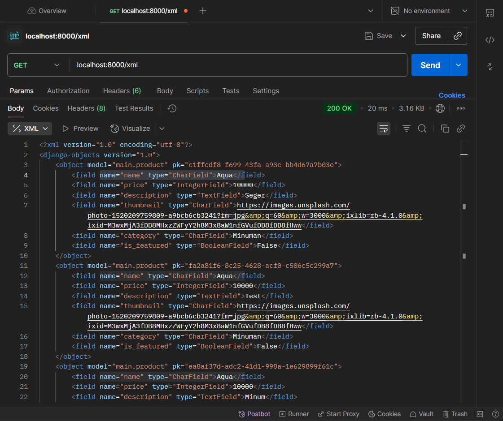
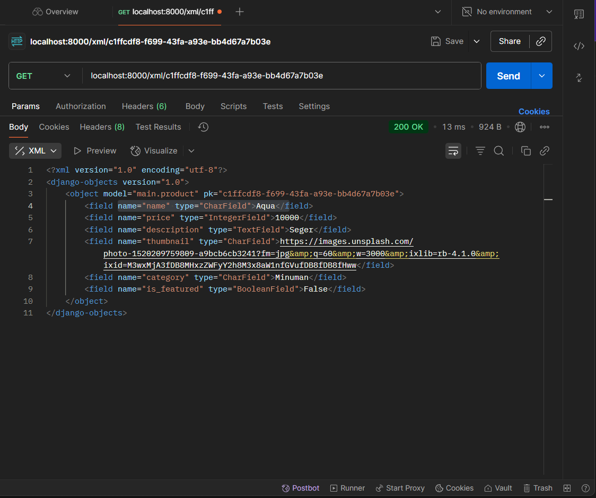
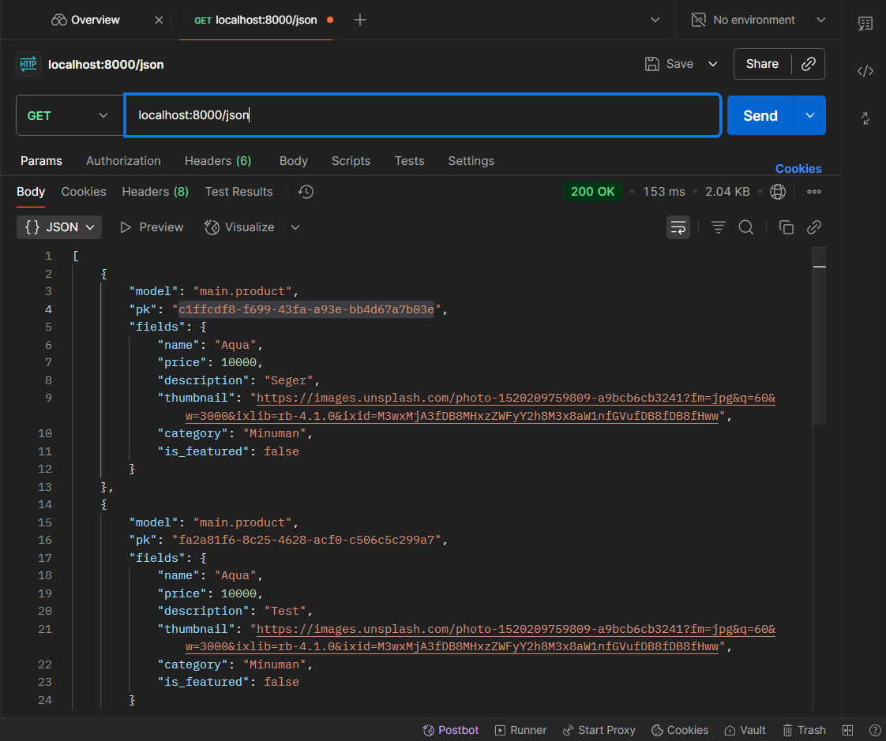
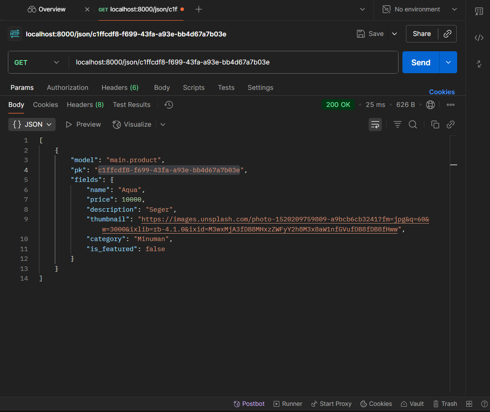

# Tugas PBP : Football Shop - FootbalXpress
## Link Aplikasi : 
https://pbp.cs.ui.ac.id/web/project/muhammad.hariz41/footballshop/build/01992684-ec29-9653-f58a-c63f010649a8

## NPM & Nama :
2406428775 - Muhammad Hariz Albaari

# Tugas 1


## Step-by-Step Implementasi Checklist Django Project

1.  Membuat proyek Django baru
    - Masuk ke folder project baru: 
        ```bash
        mkdir football-shop
        cd football-shop
        ```
    - Buat virtual env
        ```bash
        python -m venv env
        env\Scripts\activate
        ```
    - Buat projek Django Baru
        ```bash
        django-admin startproject football_shop
        ```
2.  Membuat aplikasi dengan nama main
    - Saya membuat aplikasi baru dengan
         ```bash
        python manage.py startapp main
        ```
    - Lalu menambahkan ‘main’ pada bagian INSTALLED_APPS di
      football_shop\settings.py agar Django mengenali aplikasi ini.
        ```python
        INSTALLED_APPS = [
            'main',
        ]
        ```
3.  Melakukan routing proyek agar dapat menjalankan aplikasi main
    - Buat file main/templates/main.html untuk tampilan awal.
    - Menambahkan file views.py pada folder main untuk memberikan data pada template.
        ```python
        from django.shortcuts import render

        def show_main(request):
            context = {
                'app_name': 'FootballXpress',           
                'nama': 'Muhammad Hariz Albaari',            
                'kelas': 'PBP E' 
            }
            return render(request, 'main.html', context)
        ```
    - Menambahkan file urls.py pada folder main dan football_shop untuk menghubungkan kedua file.
4.  Membuat model Product di aplikasi main
    - Pada file models.py di dalam aplikasi main, saya mendefinisikan
      sebuah model Product dengan atribut:
      - name = models.CharField(max_length=100)
      - price = models.IntegerField()
      - description = models.TextField()
      - thumbnail = models.URLField()
      - category = models.CharField(max_length=50)
      - is_featured = models.BooleanField(default=False)
    -   Setelah itu menjalankan python manage.py makemigrations lalu
        python manage.py migrate.
7.  Deployment ke PWS (PythonAnywhere atau platform sejenis)
    -   Mengupload kode Django project ke server (dengan git).
    -   Mengatur Allowed Hosts di settings.py untuk mengizinkan akses dari
        PWS.
    -   Mengisi enviros pada platform pws.
    -   Setelah berhasil, proyek dapat diakses melalui domain publik
        yang diberikan oleh PWS.

Dengan langkah-langkah ini, proyek Django yang saya buat tidak hanya
berjalan di lokal, tetapi juga bisa diakses teman-teman melalui
<br></br>
## Bagan Request Client ke Web Aplikasi Berbasis Django 
[Client Request: Browser mengakses URL]  
 
 |  
 v   

urls.py     > Mencocokkan URL yang diminta dengan pola routing   

 |  
 v   

views.py    > Mengolah permintaan, memanggil model bila perlu  

 |  
 v   

models.py   > Berinteraksi dengan database (ORM Django)  

 |  
 v   

Template    > views.py mengembalikan data ke template untuk dirender  

 |  
 v 
 
[Response: HTML dikirim ke Client Browser]  
<br></br>
## Settings.py, Pusat Konfigurasi Django. 

Isinya meliputi:
- Database (ENGINE, NAME, USER, PASSWORD, HOST, PORT).
- Installed apps (aplikasi yang dipakai proyek).
- Middleware (lapisan proses request/response).
- Static files & Media files (CSS, JS, gambar).
- Templates (lokasi file HTML).
- Security (SECRET_KEY, DEBUG mode, ALLOWED_HOSTS).
<br></br>
## Cara Kerja Migrasi Database di Django?
Migrasi digunakan untuk menjaga sinkronisasi antara models.py dan database.
Buat/ubah model di models.py.
Jalankan:
```bash
python manage.py makemigrations
```
Django membuat file migrasi (instruksi perubahan database).

Jalankan:
```bash
python manage.py migrate
```

Django mengeksekusi file migrasi, membuat/mengubah tabel sesuai model.
Dengan migrasi, perubahan struktur database bisa dilacak dan dikelola secara otomatis.
<br></br>
## Mengapa Framework Django Dijadikan Permulaan Pembelajaran Pengembangan Perangkat Lunak?
Django cocok dijadikan framework pertama karena dibangun dengan Python yang sintaksnya sederhana, mudah dipahami pemula dan sudah diajarkan di kelas DDP 1. Django juga sudah menyediakan banyak fitur bawaan (seperti ORM, autentikasi, admin, dan template engine) sehingga pemula bisa langsung fokus memahami alur kerja pengembangan web. Selain itu, Django memiliki struktur yang jelas dengan pola Model-Template-View (MTV) yang membantu belajar membangun aplikasi secara terorganisir. Dokumentasinya lengkap, komunitasnya besar, dan framework ini bisa digunakan untuk proyek kecil hingga skala besar, sehingga sangat ideal untuk mulai belajar pengembangan perangkat lunak berbasis web.


# Tugas 2

## Step-by-Step
1. Menambahkan Product.id pada model agar dapat diakses by id.
2. Menambahkan 6 fungsi baru pada views.py untuk menambahkan objek model, melihat semua objek model, melihat satu objek model (Dalam bentuk json, xml, atau html (pada template)).
3. Membuat routing URL untuk masing-masing views yang telah ditambahkan pada poin 2.
3. Membuat template:
    - main.html (update) : menampilkan seluruh product, dan menampilkan tombol "Add" untuk produk baru, serta tombol "Detail"   pada setiap data objek model yang akan menampilkan halaman detail objek.
    - create_product.html : menampilkan form tambah produk menggunakan forms.py (pada views.py)
    - show_product.html : menampilkan detail produk individual
5. Membuat forms.py untuk menambahkan product.
6. Melekukan migration, dan testing pada local dengan 
    ```bash
    python manage.py runserver
    ```
7. Deploy ke PWS dan commit github 

## Mengapa kita memerlukan data delivery dalam pengimplementasian sebuah platform?
Data delivery diperlukan dalam pengimplementasian sebuah platform karena berfungsi sebagai jembatan antara penyimpanan data dan pemanfaatannya, tanpa mekanisme penyampaian data yang baik, informasi hanya tersimpan di sistem tanpa bisa diakses atau digunakan. Melalui data delivery, data dapat diakses oleh pengguna, aplikasi lain, maupun layanan eksternal secara konsisten, real-time, dan dalam format yang sesuai (misalnya JSON atau XML).

## Mana yang lebih baik antara XML dan JSON? Mengapa JSON lebih populer dibandingkan XML?
JSON lebih populer dibandingkan XML karena strukturnya lebih sederhana, ringkas, mudah dibaca manusia, dan cepat diproses oleh mesin, khususnya dalam ekosistem web yang secara native mendukung JavaScript, sedangkan XML meskipun lebih kaya fitur untuk representasi data kompleks dan validasi dengan skema, sintaksnya cenderung lebih berat untuk diproses, sehingga dalam pengembangan aplikasi modern JSON lebih dipilih sebagai standar utama pertukaran data.

## Fungsi dari method is_valid() pada form Django dan mengapa kita membutuhkan method tersebut?
Method is_valid() pada form Django berfungsi untuk melakukan validasi data yang dikirimkan pengguna sesuai dengan aturan yang sudah didefinisikan di form maupun model terkait. Ketika dipanggil, is_valid() akan mengecek apakah semua field sudah diisi dengan benar, apakah tipe data sesuai (misalnya angka untuk field integer), serta apakah aturan validasi tambahan terpenuhi. Jika semua valid, method ini akan mengembalikan True dan menyimpan data yang sudah dibersihkan di form.cleaned_data; jika tidak valid, ia mengembalikan False dan error akan tersimpan di form.errors.

## Mengapa kita membutuhkan csrf_token saat membuat form di Django? Apa yang dapat terjadi jika kita tidak menambahkan csrf_token pada form Django? Bagaimana hal tersebut dapat dimanfaatkan oleh penyerang?
Kita membutuhkan **`csrf_token`** pada form di Django karena token ini berfungsi sebagai mekanisme keamanan untuk mencegah **Cross-Site Request Forgery (CSRF)**, yaitu serangan di mana penyerang mencoba mengelabui pengguna agar tanpa sadar mengirimkan permintaan berbahaya ke server (misalnya mengubah password atau melakukan transaksi) dengan memanfaatkan sesi login yang masih aktif. Jika `csrf_token` tidak ditambahkan, Django tidak dapat memastikan bahwa permintaan benar-benar berasal dari form sah di aplikasi, sehingga penyerang bisa membuat halaman berisi form tersembunyi atau script yang otomatis mengirim request ke server atas nama korban. Akibatnya, aksi sensitif seperti transfer dana, perubahan data akun, atau penghapusan informasi bisa dilakukan tanpa sepengetahuan pengguna. Dengan adanya `csrf_token`, setiap form sah memiliki token unik yang diverifikasi server, sehingga permintaan palsu dari luar akan ditolak.

 
## Screenshot dari hasil akses URL pada Postman, dan menambahkannya ke dalam README.md.
XML

XML By ID

JSON

JSON By ID

